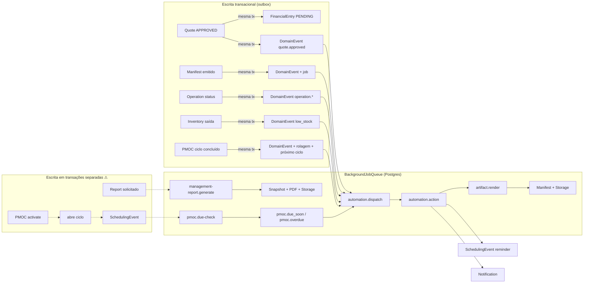

# Revisão Arquitetural PR-26.5

Auditoria do Orbit V2 antes do Frontend PR-24 (PMOC UI).
Data: 14/08/2026 · Base: `main` @ `a2e771e` + PRs 21–26 aplicadas.

**Nenhuma feature foi implementada e nenhum código de produção foi alterado
nesta revisão.** As duas únicas mudanças foram no banco de desenvolvimento, para
produzir prova, e estão registradas na seção *Alterações feitas durante a
auditoria*.

---

## Resumo executivo

O Orbit está arquiteturalmente sólido no que foi construído com intenção:
fronteiras de domínio claras, idempotência empurrada para o banco, snapshots
imutáveis, outbox transacional na maior parte dos fluxos e Read Models sem
vazamento de Prisma. A suíte inteira passa (346 unitários, 126 E2E, 9 suítes).

**Isso não significa que esteja pronto.** A auditoria encontrou dois problemas
que os testes não podem detectar por construção, e um deles torna incorreto um
recurso já entregue:

1. **A RLS nunca é exercida.** O papel PostgreSQL da aplicação é superusuário e
   contorna toda política. As 68 tabelas com `FORCE ROW LEVEL SECURITY` estão
   decorativas em qualquer ambiente que use o `docker-compose` deste repositório.
   O isolamento que de fato funciona hoje é o da camada de aplicação.
2. **Sob RLS real, a geração de relatório gerencial de organização inteira
   compõe zeros.** O worker reabre o contexto do tenant com a unidade do job; um
   job sem unidade produz escopo de unidade vazio, e toda tabela recortada por
   unidade devolve zero linha. **299 dos 315 jobs de relatório no banco estão
   nessa condição.**

O segundo é consequência direta do primeiro: o defeito existe desde a PR-25 e
passou por 25 cenários de E2E porque o superusuário ignora a política que o
revelaria.

---

## A. Architecture Findings

| ID | Sev | Domínio | Finding | Evidência | Risco | Recomendação |
|---|---|---|---|---|---|---|
| **A-01** | 🔴 BLOCKER | Jobs / RLS | Worker com `businessUnitId` nulo perde acesso a **toda** tabela recortada por unidade | Papel não-superuser, `app.business_unit_ids=''`: `operations` → **0 linhas** (superusuário vê 6). `management_reports` → 20 (política é por organização, então a própria linha do relatório é visível) | Relatório executivo/operacional/financeiro **com zeros** em produção com RLS ligada. Falha silenciosa: `status=READY`, hash válido, snapshot vazio | Ao enfileirar sem unidade, propagar as unidades da organização (ou marcar o job como "escopo organização" e o worker montar `businessUnitIds` a partir das unidades ativas). Ver PR-26.6 |
| **A-02** | 🔴 BLOCKER | Infra / RLS | Papel da aplicação é `SUPERUSER` + `BYPASSRLS` | `pg_roles`: `sannin_saas_user` → `rolsuper=t, rolbypassrls=t`. `POSTGRES_USER` do compose cria o superusuário do contêiner | Nenhuma política RLS é aplicada em nenhum ambiente que use este compose. Defense-in-depth ausente; um bug de `where` na aplicação vira vazamento entre tenants | Criar papel de aplicação sem `SUPERUSER`/`BYPASSRLS` com `GRANT` explícito, e apontar `DATABASE_URL` para ele. Ver PR-26.6 |
| **A-03** | 🟠 HIGH | Scheduling | Agenda agrupa e recorta o dia em **UTC**, ignorando o fuso que a própria tabela guarda | `scheduling.service.ts:287` agrupa por `event.startsAt.slice(0,10)`; `:295` declara `timezone: 'UTC'`; `viewRange` (`:1167`) usa `setUTCHours/​setUTCDate` | Evento das 22h em Recife aparece no dia seguinte; "este mês" começa às 21h do último dia do mês anterior. Mobile consome `/scheduling/agenda` | Agrupar e recortar no fuso do calendário/unidade (`AT TIME ZONE` no banco ou `Intl` no serviço) e publicar o fuso real no `range`. Ver PR-26.7 |
| **A-04** | 🟠 HIGH | Scheduling | Regra de disponibilidade compara dia da semana em UTC | `ruleApplies` (`:1193-1196`): `toISOString().slice(0,10)` e `getUTCDay()` | Disponibilidade de "segunda" não casa com evento das 22h de domingo local. Mesma classe de A-03 | Corrigir junto com A-03 |
| **A-05** | 🟠 HIGH | Automations | Regra não valida se a unidade escolhida está no escopo do ator | `automation.service.ts:131-137` valida só a organização. PMOC (`assertUnitInScope`) e Reports (`resolveUnit`) validam | Usuário restrito à unidade A cria regra ligada à unidade B — ou sem unidade — e provoca escrita (lembrete/notificação) na unidade B | Aplicar a mesma checagem dos outros dois módulos |
| **A-06** | 🟠 HIGH | Analytics | `analytics.read` é porta única sobre snapshot multi-domínio, incluindo PMOC | `analytics.controller.ts:22` (`@Capabilities('analytics.read')`); `analytics.repository` lê `operations`, `pmoc_executions`, `assets`, `customers` | Quem não tem `pmoc.read` nem `operations.read` lê conformidade de PMOC e volume operacional agregados. Invariante violada — a mesma que a PR-25 corrigiu em Reports. **Agravado pela PR-26** | Autorização composta por domínio consumido, como em Management Reports |
| **A-07** | 🟡 MEDIUM | Reports / Storage | Falha de geração deixa o PDF órfão no storage | 46 `storage_files` `AVAILABLE` no namespace `reports` sem `management_reports.file_id`; 21 jobs `DEAD` na fila | Crescimento silencioso do bucket; nenhum caminho de limpeza ou exclusão | Gravar o arquivo **depois** do snapshot, ou registrar `fileId` na mesma transação de `markReady`; varredura de órfãos |
| **A-08** | 🟡 MEDIUM | Reports | `createOrReuse` e `enqueue` em transações distintas | `report.service.ts` chama `repository.createOrReuse(...)` e depois `jobs.enqueue(...)` fora de transação | Queda entre as duas deixa o relatório `PENDING` para sempre — **e o índice parcial de "em andamento" bloqueia gerar o mesmo recorte de novo** | Enfileirar dentro da transação (padrão outbox já usado por Quotes, Manifests e Domain Events) |
| **A-09** | 🟡 MEDIUM | PMOC | Ativação escreve em quatro transações; sem caminho de reparo | `pmoc.service.ts`: `activate` → `openCycle` → `ensureSchedulingEvent` → 2 `enqueue`. `activate()` só aceita `DRAFT`/`SUSPENDED` | Queda no meio deixa plano `ACTIVE` sem ciclo aberto: não dá para concluir manutenção nem reativar. **A UI de PMOC age sobre o ciclo** | Abrir o ciclo na mesma transação da ativação, ou tornar a abertura idempotente e acionável. Ver PR-26.8 |
| **A-10** | 🟡 MEDIUM | Jobs | Sem retenção: fila cresce indefinidamente | 1.726 `SUCCEEDED` retidos; `background_jobs` = 1.568 kB; nenhum `DELETE` no módulo | Tabela e índices crescem sem teto; `claim()` degrada com o tempo | Retenção por idade para `SUCCEEDED` (ex.: 30 dias), preservando `DEAD` |
| **A-11** | 🟡 MEDIUM | Jobs | Dead-letter sem superfície de operação | 33 jobs `DEAD` visíveis só por SQL; nenhuma rota os publica | Falha permanente invisível para quem opera o produto | Endpoint administrativo de leitura + contador no health |
| **A-12** | 🟡 MEDIUM | Identity / RLS | Tabelas de identidade sem RLS, algumas com `organization_id` | Sem RLS: `users`, `sessions`, `credentials`, `mfa_factors`, `password_reset_tokens`, `identity_invitations`, `plans`, `modules`. `identity_invitations` e `sessions` **têm** `organization_id` | Convites e sessões dependem só da aplicação para isolamento | RLS por organização em `identity_invitations` e `sessions`; as demais são globais por natureza e devem ser declaradas como tal |
| **A-13** | 🟡 MEDIUM | Operations | Máquina de estados não é publicada | `operation.read-models.ts` não tem `transitions` (Quote tem; PMOC tem `allowedTransitions`). `operation-actions.tsx:480` oferece **todos** os status e deixa o backend recusar | Usuário descobre transição inválida por erro. Inconsistência entre três módulos irmãos | Publicar `transitions` no Read Model de Operation |
| **A-14** | 🟡 MEDIUM | Schema | Banco aplicado diverge do schema Prisma em 42 grupos | `prisma migrate diff --from-config-datasource --to-schema`: 84 índices renomeados, 14 defaults de `updated_at`, FKs redeclaradas. **Nenhuma diferença semântica** | O detector natural da classe de erro "back-relation acidental" está inutilizável por ruído — e essa classe já causou dois incidentes (PR-25 e PR-26) | Alinhar nomes de índice ao padrão do Prisma nas migrações **novas** e adicionar guarda de drift filtrada (falhar só em coluna/tabela adicionada ou removida) |
| **A-15** | 🟡 MEDIUM | Dashboard | Widget de PMOC exige capability errada | `widget-registry.ts:199-207`: `requiredModules: ['reports']`, `requiredPermissions: ['reports.read']` | Depois da PR-26, o widget de PMOC é liberado por permissão de relatório de visita e escondido de quem tem `pmoc.read` | Trocar para `pmoc.read` |
| **A-16** | 🟡 MEDIUM | Contracts | Mobile mantém contratos Dart escritos à mão | `mobile/lib/core/contracts/` (7 arquivos), incluindo `agenda_contracts.dart`; nenhum é gerado do backend | Divergência silenciosa entre Web (sincronizado) e Flutter (manual). Mobile consome `/scheduling/agenda`, afetado por A-03 | Congelar os contratos que o mobile usa antes de retomá-lo; gerar ou testar contra o schema publicado |
| **A-17** | 🟢 LOW | Contracts | Nada impede um Read Model sincronizado de importar código de servidor | Dois incidentes (`automation.read-models`, `pmoc.read-models`) só apareceram no `tsc` do frontend, depois do sync | Quebra do build do frontend descoberta tarde | Teste de arquitetura no backend: Read Model sincronizado só importa de `contracts` ou de outro Read Model |
| **A-18** | 🟢 LOW | Frontend | `x-timezone` do navegador viaja e nunca é lido | `context-headers.ts:8`; `RequestContext` do backend não tem campo de fuso | Cabeçalho morto convida a "só usar" mais tarde — exatamente o que PRs 25/26 proíbem | Remover o cabeçalho, ou documentar que é reservado |
| **A-19** | 🟢 LOW | Frontend | Troca de contexto não cancela requisições em voo | `request-context-provider.tsx:83` usa `removeQueries`; as keys não carregam unidade | Resposta da unidade anterior pode repovoar o cache depois da troca | `cancelQueries` antes de `removeQueries` |
| **A-20** | 🟢 LOW | Jobs | Vazão limitada a 1 job por fila por ciclo | `background-job.worker.ts`: `claim()` único por processador; intervalo padrão 2 s → 30 jobs/min/fila por worker | Fan-out de automação pode atrasar sob carga. Sem impacto no volume atual | Reavaliar quando uma fila acumular; **não** trocar de tecnologia por isso |

---

## B. Debt & Gap Register

| Gap | Status | Domínio | Impacto | PR sugerida | Antes da UI de PMOC? |
|---|---|---|---|---|---|
| RLS não exercida (papel superusuário) | **OPEN** | Infra | Defense-in-depth ausente; testes provam aplicação, não banco | PR-26.6 | **Sim** |
| Worker sem unidade não enxerga dados de unidade | **OPEN** | Jobs | Relatório de organização inteira zerado sob RLS | PR-26.6 | **Sim** |
| Agenda agrupa por UTC | **OPEN** | Scheduling | Evento noturno no dia errado; mobile afetado | PR-26.7 | **Sim** |
| Ativação de PMOC não atômica | **OPEN** | PMOC | Plano ativo sem ciclo, sem reparo | PR-26.8 | **Sim** |
| Automação sem checagem de escopo de unidade | **OPEN** | Automations | Escrita cross-unit por usuário restrito | PR-26.8 | Não |
| `analytics.read` como porta única multi-domínio | **OPEN** | Analytics | Bypass de `pmoc.read`/`operations.read` em agregados | PR-26.9 | Não |
| Contract entity | **OPEN** | — | KPI `contracts.active_proxy` conta clientes ativos | — | Não |
| Operation authorization aplicada no domínio | **PARTIAL** | Operations | Preferência gravada, **nunca lida**; UI declara a ausência | PR própria | Não |
| Equipment health / criticidade | **OPEN** | Assets | Sem fonte; nenhuma métrica publicada | — | Não |
| Environmental intelligence | **INTENTIONAL** | Dashboard | `source: 'MOCK'` declarado no contrato e excluído dos relatórios | — | Não |
| SLA contratual | **INTENTIONAL** | Operations | Cumprimento medido contra `scheduledEnd`, marcado `DERIVED` com nota | — | Não |
| Scheduling intelligence (rotas/conflitos) | **INTENTIONAL** | Scheduling | `source: 'MOCK'` no Read Model | — | Não |
| Multi-organization switching | **OPEN** | Identity | Token deriva uma organização; `canSwitchOrganization` desligado | — | Não |
| Audit/history públicos | **OPEN** | Vários | `AuditLog` grava tudo; nenhuma rota publica ao tenant | — | Não |
| Notification realtime | **OPEN** | Notifications | Polling por `CACHE.live` | — | Não |
| Inventory reservations | **OPEN** | Inventory | `reserved` publicado, sem fluxo que reserve | — | Não |
| Quote → Artifact mapping | **OPEN** | Quotes | Sem template de proposta ligado ao orçamento | — | Não |
| PMOC regulatório (ART/RRT/CREA) | **INTENTIONAL** | PMOC | Fora do domínio; vive no formulário do artefato | — | Não |
| Platform Admin frontend | **OPEN** | Platform | API existe; UI é landing | — | Não |
| Offline sync mobile | **OPEN** | Mobile | Fila de upload existe; sync completo não | — | Não |
| Retenção da fila | **OPEN** | Jobs | 1.726 jobs retidos | PR-26.9 | Não |
| Órfãos de storage | **OPEN** | Storage | 46 arquivos sem dono | PR-26.9 | Não |
| Drift schema × migrações | **PARTIAL** | Schema | 42 grupos cosméticos mascaram o detector | PR-26.9 | Não |

---

## C. Dependency / Data Flow Map

**Leitura do mapa.** As setas sólidas são atômicas: o fato e o efeito
compartilham transação. As pontilhadas são as janelas de estado parcial — A-08 e
A-09. Toda seta que entra em `queue` depende de o job ser reivindicado com o
contexto certo, que é onde A-01 morde.

---

## D. Source-of-Truth Matrix

| Conceito | Autoridade | Projeção / Snapshot | Consumidores |
|---|---|---|---|
| Quantidade em estoque | `inventory_movements` (append-only) | `inventory_balances` — projeção reconstruível, escrita na mesma transação do movimento | Inventory API, Reports, Dashboard |
| Valor financeiro | `financial_entries` (`Decimal`) | `FinancialSummary`/`byCategory`/`timeline` — derivadas por consulta | Financial API, Reports, Quotes (previsão) |
| Total de orçamento | `quotes.subtotal/discount/total`, recalculado pelo servidor a cada mudança de item | Nenhuma — sempre recalculado, nunca somado no cliente | Quotes API, Reports comerciais |
| Conformidade PMOC | `pmoc_plans.next_due_on` + `current_date` do servidor | Estado derivado **na leitura** (`evaluateCompliance` + predicado SQL espelhado) | PMOC API, Reports, Analytics KPI |
| Data de agendamento | `scheduling_events.starts_at` (+ `timezone` da linha) | Ocorrências expandidas por `occurrences()` — **hoje agrupadas em UTC (A-03)** | Agenda web, mobile, PMOC |
| Documento de artefato | `artifact_manifests` (revisão, `content_hash`, `source_hash`) | `artifact_snapshots` — imutável por definição | Document Center, PMOC (evidência) |
| Relatório gerencial | `management_reports.data` — **snapshot imutável**, com `source_hash` | Nenhuma; leitura nunca recompõe | Reports Center |
| Métrica de Analytics | Nenhuma própria: compõe `operations`, `pmoc_executions`, `assets`, `customers` | Cálculo em memória por requisição (não persistido) | Dashboard, Analytics API |
| Situação de renderização | `artifact_executions.render_status` | Espelho do pipeline; reconstruível a partir dos manifests | Document Center |
| Ciclo de PMOC | `pmoc_executions` (um por vencimento) | `PmocPlan.last_executed_at`/`next_due_on` — derivados, escritos na mesma transação | PMOC API, Reports |

**Projeções sem detector de divergência.** `inventory_balances` guarda
`balanceAfter` em cada movimento, o que torna a divergência *detectável* — mas
não há rotina que a detecte nem que reconstrua. `pmoc_plans.next_due_on` é
derivado do último ciclo e também não tem verificação. Ambos são dívida
consciente enquanto a escrita permanecer transacional.

---

## E. Pre-PR-24 Gate

### MUST FIX BEFORE FRONTEND PR-24

| # | Item | Por que bloqueia |
|---|---|---|
| 1 | **A-09 — ativação de PMOC atômica** | A UI de PMOC opera sobre o **ciclo**: concluir manutenção, gerar ordem, anexar evidência. Um plano `ACTIVE` sem ciclo não tem ação possível e não tem reparo pela API. É o único bloqueador que nasce dentro do próprio domínio que a UI vai consumir |
| 2 | **A-03/A-04 — fuso da Agenda** | A UI de PMOC mostra "próxima manutenção" e leva o usuário à Agenda. Com o agrupamento em UTC, a data que a tela de PMOC mostra e a que a Agenda mostra **podem discordar em um dia** — e o usuário não tem como saber qual está certa. Construir a UI sobre duas datas divergentes é construir sobre um bug |
| 3 | **A-01 — contexto de unidade no worker** | Não afeta a UI de PMOC diretamente, mas é falha silenciosa em recurso já entregue. Corrigir agora custa uma PR pequena; corrigir depois de a UI de relatórios estar em uso custa confiança no número |

### SHOULD FIX SOON

- **A-02** — papel de banco sem superusuário. Deve vir junto de A-01: é o que
  transforma os testes de isolamento em prova.
- **A-05** — escopo de unidade em Automations (inconsistência entre irmãos).
- **A-06** — autorização composta em Analytics (a PR-26 aumentou a superfície).
- **A-08** — outbox no Management Report.
- **A-15** — capability do widget de PMOC (uma linha).
- **A-13** — publicar `transitions` de Operation, antes que a UI de PMOC copie o
  padrão de "oferecer tudo e deixar o backend recusar".

### CAN WAIT

A-07, A-10, A-11, A-12, A-14, A-16, A-17, A-18, A-19, A-20 e todos os gaps
marcados `INTENTIONAL`. São dívidas reais, nenhuma delas torna incorreto o que
está em produção.

---

## F. Sequenciamento recomendado

| PR | Escopo | Tamanho |
|---|---|---|
| **PR-26.6** | Papel de banco sem `SUPERUSER`/`BYPASSRLS`; `businessUnitIds` do worker resolvido a partir da organização quando o job não tem unidade; E2E de RLS com papel real (um cenário por classe de política) | Média |
| **PR-26.7** | Fuso da Agenda: agrupamento, `viewRange` e `ruleApplies` no fuso do calendário; `range.timezone` real no Read Model; contrato sincronizado | Pequena |
| **PR-26.8** | Ativação de PMOC atômica (ciclo na transação da ativação); escopo de unidade em Automations | Pequena |
| **PR-26.9** | Higiene: outbox no Report, retenção da fila, varredura de órfãos, capability do widget, `transitions` de Operation | Média |

Depois disso, **Frontend PR-24 (PMOC UI)** sobre um domínio cujo estado é
verificável e cujas datas concordam entre telas.

---

## Alterações feitas durante a auditoria

Nenhuma alteração de código. No banco de desenvolvimento:

| O quê | Por quê | Como desfazer |
|---|---|---|
| `CREATE ROLE orbit_rls_probe` (sem superusuário) | Provar A-01/A-02 — era impossível demonstrar sem um papel que respeite RLS | `DROP ROLE orbit_rls_probe;` |
| `CREATE DATABASE orbit_shadow_probe` | Tentativa de `migrate diff` com shadow database | `DROP DATABASE orbit_shadow_probe;` |

---

## Validação executada

| Verificação | Resultado | Classificação |
|---|---|---|
| `prisma validate` | ✅ válido | — |
| `prisma migrate status` | ✅ 27 migrações aplicadas | — |
| `prisma generate` | ✅ | — |
| `nest build` | ✅ | — |
| `eslint .` (backend) | ✅ 0 erros | — |
| `tsc --noEmit` (backend) | ⚠️ **24 erros**, todos em specs: `background-job.queue.spec` (10), `artifact-html.renderer.spec` (6), `artifact-rendering.e2e-spec` (3), `artifact-manifest.e2e-spec` (2), `integration.service.spec` (2), `platform-administration.service.spec` (1) | **PRE-EXISTING** — anteriores à PR-21; nenhum em código de produção |
| Unitários | ✅ 346 / 55 suítes | — |
| E2E | ✅ 126 / 9 suítes | — |
| `contracts:sync` | ✅ | — |
| `tsc --noEmit` (frontend) | ✅ 0 erros | — |
| `eslint .` (frontend) | ✅ 0 erros, 4 warnings | **PRE-EXISTING** (``, fonte custom) |
| `next build` | ✅ | — |
| `flutter analyze` | ✅ sem issues | — |
| `git diff --check` | ✅ | — |
| Testes de arquitetura | ❌ **não existem** | Ver A-17 |
| Testes de RLS | ❌ **não existem como prova** | Ver A-02 |

**Nenhuma falha NEW.** O gate está verde no sentido literal — e é exatamente por
isso que este relatório existe: os dois bloqueadores são invisíveis para a
bateria atual.

---

## Definition of Done — respostas

**1. Fontes de verdade.** Ver matriz na seção D. Resumo: movimento manda no
saldo, lançamento manda no dinheiro, `next_due_on` manda na conformidade,
manifest manda no documento, snapshot manda no relatório. Analytics não tem
fonte própria — compõe outras.

**2. Proxies ainda existentes.** Três `MOCK` declarados no contrato
(environmental provider, scheduling intelligence, environmental impact engine) e
um `PROXY` (`contracts.active_proxy` contando clientes ativos). Todos são
intencionais, marcados no Read Model e — desde a PR-25 — excluídos dos
relatórios gerenciais com o motivo publicado. O proxy de PMOC **deixou de
existir** na PR-26. Nenhum proxy novo foi introduzido.

**3. Fronteiras frágeis.** Analytics (porta única sobre vários domínios, A-06);
Automations (escopo de unidade não conferido, A-05); Scheduling (fuso, A-03);
mobile (contratos paralelos, A-16). As fronteiras Artifact/Report/PMOC/Financial
estão sólidas: nenhum PDF define domínio, `Receipt ≠ FinancialEntry`,
`Quote ≠ Operation`, `ManagementReport ≠ ArtifactExecution`, `PMOC ≠ documento`.

**4. Fluxos assíncronos que podem falhar parcialmente.** Report (A-08), PMOC
activate (A-09) e o storage de relatório (A-07). Todo o resto usa outbox e é
atômico.

**5. RLS está comprovada?** **Não.** As políticas existem e são coerentes, mas
nenhum teste as exerce, e o papel de banco as contorna. O que os E2E provam hoje
é isolamento na camada de aplicação — que é real e vale, mas é uma camada só.

**6. Tempo e fuso estão consistentes?** **Parcialmente.** Datas do tipo `DATE`
(competência financeira, validade de orçamento, vencimento de PMOC) são
consistentes e usam `make_interval` para semântica de calendário. Instantes
convertidos em dia estão errados no Scheduling (A-03/A-04) e no bucket do
Analytics. Management Reports usa `AT TIME ZONE` corretamente.

**7. Dívidas que bloqueiam a UI de PMOC.** A-09, A-03/A-04 e A-01, nesta ordem.

**8. Sequência recomendada.** PR-26.6 → PR-26.7 → PR-26.8 → PR-26.9 → Frontend
PR-24.
